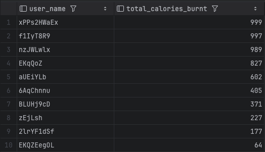
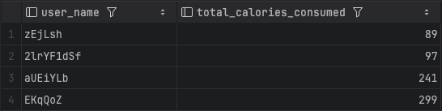

# Stage 3

Stage 3 is about Database Implementation and Indexing, we used local MySQL to create and build tables.

## Revised ER Diagram

Before everthing for Stage 3, here is our revised version ER Diagram.


## Database Connection


## Database Setup

```bash
CREATE DATABASE fitness_database;
USE fitness_database;
```

This command creates a new database called fitness_database and sets it as the active database.

## Schema Design

Below are the SQL statements to create the necessary tables and defin relationships.

```bash
DROP TABLE IF EXISTS user;
CREATE TABLE user (
    id INT PRIMARY KEY,
    user_name VARCHAR(255),
    age INT,
    password VARCHAR(255),
    email VARCHAR(255),
    goal_id INT,
);

DROP TABLE IF EXISTS exercise;
CREATE TABLE exercise (
    id INT PRIMARY KEY,
    exercise_name VARCHAR(255),
    calories REAL,
    type VARCHAR(255)
);

DROP TABLE IF EXISTS workout_log;
CREATE TABLE workout_log (
    id INT PRIMARY KEY,
    user_id INT,
    date TIMESTAMP,
    calories_burnt INT,
    FOREIGN KEY (user_id) REFERENCES user(id)
);

DROP TABLE IF EXISTS affiliations;
CREATE TABLE affiliations ( # relation table between workout_log & exercise
    workout_log_id INT,
    exercise_id INT,
    PRIMARY KEY (workout_log_id, exercise_id),
    FOREIGN KEY (workout_log_id) REFERENCES workout_log(id),
    FOREIGN KEY (exercise_id) REFERENCES exercise(id)
);

DROP TABLE IF EXISTS fitness_goal;
CREATE TABLE fitness_goal (
    id INT PRIMARY KEY,
    user_id INT,
    goal_type VARCHAR(255),
    FOREIGN KEY (user_id) REFERENCES user(id)
);

DROP TABLE IF EXISTS food;
CREATE TABLE food (
    id INT PRIMARY KEY,
    name VARCHAR(255),
    calories REAL
);

DROP TABLE IF EXISTS takein;
CREATE TABLE takein ( # relation table between workout_log & food
    food_id INT,
    workout_log_id INT,
    PRIMARY KEY (food_id, workout_log_id),
    FOREIGN KEY (food_id) REFERENCES food(id),
    FOREIGN KEY (workout_log_id) REFERENCES workout_log(id)
);

```

## Data Insertion

We used [DataGrip](https://www.jetbrains.com/datagrip/). Firstly we connect DataGrip to our local machine, then [DataGrip](https://www.jetbrains.com/datagrip/) allows us to import the data using .csv or .xlsx file. We created 7 .csv or .xlsx files, headers align the same as our tables' headers and insert these files to our tables successfully.

#### user


#### exercise

'exercise table count'

#### workout_log

'workout_log count'

#### food

'food count'

#### fitness_goal

'fitness_goal count'

#### affliations

'affiliations count'

#### takein

'takein count'

## SQL Queries & Indexing

##### Everytime we apply a new indexing, we remove the old one.

### Query1: Total Calories Burned by Each User

This query aggregates the total calories burned by each user (age <= 50) and sorts them in descending order.

```bash
SELECT u.user_name, SUM(wl.calories_burnt) AS total_calories_burnt
FROM user u
JOIN workout_log wl ON u.id = wl.user_id
WHERE u.age <= 50
GROUP BY u.user_name
ORDER BY total_calories_burnt DESC;
```

Result Screenshot:



#### Indexing

Baseline:

'Q1beforeIdx.png'

The three indexing strategies we choose are indexing on user(age), user(user_name), and user(user_name, age).

'age.png'

Explanation:

The index on user(age) was selected because it provided a measurable and consistent reduction in query cost by optimizing the query's most impactful clause—the WHERE filter on age. This design avoids unnecessary indexing, focusing specifically on the attribute that offers the greatest performance benefit for this query. The user(age) index is the most efficient and targeted choice, ensuring optimized query execution while avoiding redundant or overly complex indexing strategies. This approach balances performance with simplicity, making it a sustainable solution for queries with similar filtering needs.

'userName.png'

Explanation:

The index on user(user_name) did not reduce the query cost because it does not target the most resource-intensive parts of the query execution process. Here are the main reasons why this indexing strategy had minimal impact:
The user_name column is only used in the GROUP BY and ORDER BY clauses. These operations typically benefit more from indexing when there are numerous unique values, allowing the index to create distinct groups or ordered sets efficiently. However, without a high level of distinct values or if the query’s main cost is due to row filtering (e.g., the WHERE clause), indexing user_name does not provide a significant improvement.
In this query, the WHERE clause filtering on age plays a central role in reducing the number of rows processed before aggregation and ordering. Since user_name is not involved in filtering, indexing it does not reduce the number of rows considered, resulting in no noticeable effect on query performance.

'userNameandAge.png'

Explanation:

The combined index on user(user_name, age) did not reduce query cost because of several key reasons related to how the database uses indices based on query structure and the selectivity of indexed attributes:

Since the query does not filter by user_name, the database may not fully utilize the combined index for performance gains, as it cannot leverage user_name to quickly narrow down results. Also, the main performance improvement in this query comes from filtering rows based on age (WHERE u.age <= 50), which is best served by an index directly on age.
Since the composite index starts with user_name, it is not optimized for filtering by age. The database engine may skip using this index entirely or use it inefficiently, as it doesn’t align with the primary goal of quickly locating rows based on age.                                                                                    Including user_name in the index does not add much value for this query’s performance. The GROUP BY and ORDER BY operations on user_name do not significantly benefit from the combined index because grouping and sorting are already relatively optimized for non-unique values like names, and the data can often be processed efficiently in-memory.

### Query2: Average Calories Consumed & Participant Count for Different Type of Exercise

Search for the average calories consumed and participant count for different type of exercise (e.calories >= 450).

```bash
SELECT e.type, ROUND(AVG(e.calories), 2) as avg_calories_per_exercise, 
       COUNT(DISTINCT wl.user_id) as participant_count
FROM exercise e
JOIN affiliations a ON e.id = a.exercise_id
JOIN workout_log wl ON a.workout_log_id = wl.id
WHERE e.calories >= 450
GROUP BY e.type
HAVING COUNT(DISTINCT wl.user_id) > 5
ORDER BY avg_calories_per_exercise DESC;
```

Result screenshot:



Our query result has fewer than 15 rows because it’s designed to show the average calories burned and participant count for each type of exercise. Since we're filtering for exercises where e.calories is greater than or equal to 450, this restriction leaves us with only 2 results.

#### Indexing

Baseline:

'Q2beforeIdx.png'

The three indexing strategies we choose are indexing on exercise(type, calories), exercise(type), and exercise(calories)

'calories.png'

Explanation:

The first index design selected was to index the exercise(calories). This decision was based on observed query cost reductions after applying the index, as revealed through the EXPLAIN ANALYZE command. By indexing e.calories, the database was able to efficiently filter rows where calories >= 450, reducing the amount of data processed in subsequent operations like JOIN, GROUP BY, and HAVING.

This improvement suggests that e.calories is an effective candidate for indexing, especially due to the selective filtering condition in the WHERE clause. Since this condition likely reduces the dataset size early in the query execution, the overall performance benefits were clear.

'type.png'

Explanation:

We observed no change in our query performance when we applied indexing on exercise(type). We believe this is because the GROUP BY and ORDER BY operations in our query aren’t significantly benefiting from this index. It’s possible that the data distribution on type isn’t very selective, or that other parts of the query, such as filtering on calories, have a greater impact on overall performance.

In this case, it seems the database optimizer is already handling the grouping and ordering on type efficiently without needing the index. This could especially be true if our dataset isn’t large enough to gain noticeable improvements from indexing on type. As a result, adding the index didn’t alter the query execution plan, leading to no observable gains in performance.

'type&calories.png'

Explanation:

The lack of performance improvement with the exercise(type, calories) index over the exercise(type) index likely results from how the query uses these columns. Since e.calories is already indexed and individually selective in the WHERE clause, the database likely optimizes filtering on calories before handling the grouping and ordering on type.

Adding a composite index (exercise(type, calories)) doesn't yield additional benefit here, as the optimizer doesn’t require a combined lookup for both columns. Instead, filtering on calories and grouping by type are handled efficiently by separate indexing on each column individually, which is why no performance gain is observed with the combined index.

### Query3: The Users Who Have More Tookin Calories Than Consumed

Search for the users who have more took in calories than consumed.

```bash
SELECT u.user_name, SUM(f.calories) as total_food_calories,
    SUM(e.calories) as total_exercise_calories,
    (SUM(f.calories) - SUM(e.calories)) as calorie_difference
FROM user u
JOIN workout_log wl ON u.id = wl.user_id
JOIN takein t ON wl.id = t.workout_log_id
JOIN food f ON t.food_id = f.id
LEFT JOIN affiliations a ON wl.id = a.workout_log_id
LEFT JOIN exercise e ON a.exercise_id = e.id
GROUP BY u.id, u.user_name
HAVING SUM(f.calories) > SUM(e.calories)
ORDER BY calorie_difference DESC;
```

Result Screenshot:


#### Indexing

Baseline:

'Q3beforeIdx.png'

The three indexing strategies we choose are indexing on food(calories), exercise(calories), and user(user_name).

'Q3afterFoodCalories.png'

'Q3afterExerciseCalories.png'

'Q3afterUserName.png'

Explanation:

The EXPLAIN ANALYZE results demonstrated consistent execution costs across all three indexing strategies, matching the baseline performance. When the index on exercise.calories was added, the query maintained its original execution cost. Similarly, the addition of the index on food.calories did not alter the execution plan's cost structure. The third strategy of indexing user.user\_name also produced comparable execution costs. Throughout all tests, the query optimizer appeared to maintain a consistent approach to executing the query, suggesting it found a stable execution path regardless of the available indexes.

The consistent execution costs across different indexing strategies reveal important characteristics about the query's execution pattern and the optimizer's decision-making process. The query's structure involves multiple JOIN operations connecting six tables (user, workout\_log, takein, food, affiliations, and exercise) before performing aggregations. In this context, the optimizer needs to process complete sets of records to fulfill the GROUP BY and aggregation requirements. The LEFT JOIN operations with the affiliations and exercise tables introduce additional complexity, as they must preserve all records from the left side of the join even when matching records don't exist. The presence of multiple SUM calculations on both the food and exercise calories, combined with their usage in both direct output and the HAVING clause condition, requires the optimizer to examine all relevant records to ensure accurate results. Additionally, the final ORDER BY clause on a computed value (calorie\_difference) necessitates completing all calculations before sorting can begin. These structural elements of the query indicate that the optimizer likely determines that accessing complete data sets through table scans and performing hash joins represents the most efficient strategy, as it needs to process all relevant records to compute accurate aggregations and maintain proper LEFT JOIN semantics. The optimizer's consistent choice suggests it has identified this as the most reliable approach for handling the query's complex requirements, explaining why the addition of individual column indexes did not significantly impact the execution plan or its costs.

### Query4: The Most-Welcomed Time Period of A Day for Different Exercise Type

Looking for the most-welcomed time period of a day for different exercise type.

```bash
SELECT
    e.type as exercise_type,
    CASE
        WHEN HOUR(wl.date) BETWEEN 6 AND 11 THEN 'Morning'
        WHEN HOUR(wl.date) BETWEEN 12 AND 17 THEN 'Afternoon'
        WHEN HOUR(wl.date) BETWEEN 18 AND 23 THEN 'Evening'
        ELSE 'Night'
    END as time_period,
    COUNT(*) as session_count,
    COUNT(DISTINCT wl.user_id) as user_count,
    ROUND(AVG(wl.calories_burnt), 2) as avg_calories
FROM exercise e
JOIN affiliations a ON e.id = a.exercise_id
JOIN workout_log wl ON a.workout_log_id = wl.id
GROUP BY
    e.type,
    CASE
        WHEN HOUR(wl.date) BETWEEN 6 AND 11 THEN 'Morning'
        WHEN HOUR(wl.date) BETWEEN 12 AND 17 THEN 'Afternoon'
        WHEN HOUR(wl.date) BETWEEN 18 AND 23 THEN 'Evening'
        ELSE 'Night'
    END
HAVING user_count >= 5
ORDER BY exercise_type, session_count DESC;
```

Result Screenshot:


The output shows less than 15 rows because the combinations are limited by the nature of the data: exercise_type only has three types (Plyometrics, Strength, and Stretching) combined with four time_period options (Morning, Afternoon, Evening, and Night), theoretically allowing for a maximum of 12 combinations (3 x 4 = 12).

#### Indexing

Baseline:

'Q4beforeIdx.png'

The three indexing strategies we choose are indexing on workout_log(date, calories_burnt), exercise(type), and workout_log(date).

'type.png'

'date.png'

'date&caloriesBurnt.png'

Explanation:

After executing EXPLAIN ANALYZE, the test results for all three indexing strategies showed execution costs similar to the baseline test. Specifically, when adding the index on exercise.type, the query optimizer selected an execution plan similar to the baseline. Similarly, adding an index on workout\_log.date did not significantly alter the query execution cost. Even the third strategy, utilizing the compound index (date, calories\_burnt), maintained stable execution plans and costs. This indicates that the query optimizer selected a relatively consistent execution path when processing this particular query.

These seemingly unexpected results actually reveal important insights about query optimizer mechanics and data access patterns. First, the HOUR function in the query requires the optimizer to perform calculations on each date field value, an operation that inherently needs to examine all relevant records in the table as time period distributions potentially span all possible hour values. This is determined by the nature of the data itself rather than any limitation. Second, the multi-table JOIN operations in the query involve complex data relationships. When evaluating different execution plans, the optimizer must consider how to most effectively access and relate these tables. In this case, the optimizer likely determines that table scans and hash joins represent the most efficient strategy, as it needs to consolidate data from multiple dimensions to generate the final result. Moreover, aggregation operations like COUNT(DISTINCT user\_id) and AVG(calories\_burnt) require processing numerous data points to generate accurate statistical results. The nature of these operations necessitates access to complete datasets rather than relying on partial data access through indexes. Finally, considering the GROUP BY clause contains a CASE expression, this dynamic grouping condition requires the optimizer to consider data organization across a broader scope. These factors collectively explain why different indexing strategies produced similar execution plans and costs. This reflects the query optimizer's tendency to select what it considers the most reliable and stable execution path when facing complex queries, rather than indicating any issue with the indexing strategies themselves.
